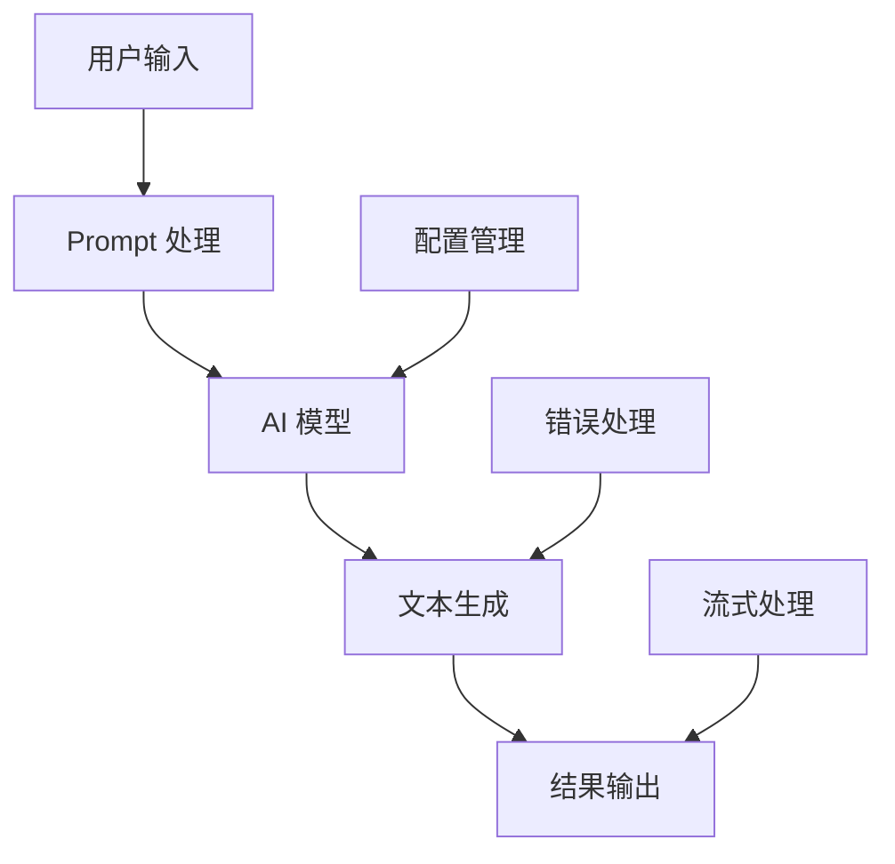

# Spring AI 文本生成（Text Generation API）

> 本文是《Spring AI 入门实践》系列的第二篇文章，将深入探讨 Spring AI 的文本生成能力，包括同步生成、流式生成、提示词工程等核心功能。

## 目录

- [文本生成概述](#文本生成概述)
- [Spring AI 文本生成 API](#spring-ai-文本生成-api)
- [项目实战](#项目实战)
- [高级功能](#高级功能)
- [性能优化](#性能优化)
- [最佳实践](#最佳实践)
- [扩展阅读](#扩展阅读)

## 文本生成概述

### 什么是文本生成？

文本生成是 AI 应用中最基础也是最常用的功能，它允许 AI 模型根据输入的提示词（Prompt）生成相应的文本内容。Spring AI 提供了统一的 API 来处理各种文本生成任务。

### 应用场景

- **内容创作** - 文章写作、故事创作、诗歌生成
- **代码生成** - 根据需求描述生成代码
- **翻译服务** - 多语言文本翻译
- **问答系统** - 智能问答和解释
- **摘要生成** - 长文本摘要和总结

### 技术架构



## Spring AI 文本生成 API

### 核心接口

Spring AI 提供了多个核心接口来处理文本生成：

#### 1. ChatClient

```java
public interface ChatClient {
    ChatResponse call(Prompt prompt);
    Flux<ChatResponse> stream(Prompt prompt);
}
```

#### 2. ChatResponse

```java
public interface ChatResponse {
    Generation getResult();
    ChatResponseMetadata getMetadata();
}
```

#### 3. Prompt

```java
public class Prompt {
    private List<Message> messages;
    private Map<String, Object> options;
}
```

### 基础使用示例

#### 同步文本生成

```java
@Service
public class TextGenerationService {
    
    private final ChatClient chatClient;
    
    public TextGenerationService(ChatClient chatClient) {
        this.chatClient = chatClient;
    }
    
    public String generateText(String prompt) {
        Prompt aiPrompt = new Prompt(prompt);
        ChatResponse response = chatClient.call(aiPrompt);
        return response.getResult().getOutput().getContent();
    }
}
```

#### 流式文本生成

```java
@Service
public class StreamingTextService {
    
    private final ChatClient chatClient;
    
    public Flux<String> generateStreamingText(String prompt) {
        Prompt aiPrompt = new Prompt(prompt);
        return chatClient.stream(aiPrompt)
            .map(response -> response.getResult().getOutput().getContent());
    }
}
```

## 项目实战

### 项目结构

基于 `spring-ai-ollama-generation` 模块，我们来构建一个完整的文本生成应用：

```
spring-ai-ollama-generation/
├── src/main/java/com/github/teachingai/ollama/
│   ├── SpringAiOllamaApplication.java
│   ├── controller/
│   │   └── ChatController.java
│   ├── service/
│   │   ├── TextGenerationService.java
│   │   └── StreamingTextService.java
│   ├── config/
│   │   └── AiConfig.java
│   └── model/
│       ├── GenerationRequest.java
│       └── GenerationResponse.java
├── src/main/resources/
│   ├── application.properties
│   └── templates/
│       └── prompts/
└── src/test/java/
    └── TextGenerationTest.java
```

### 核心实现

#### 1. 控制器层

```java
@RestController
@RequestMapping("/api/generation")
@Slf4j
public class ChatController {

    private final TextGenerationService textGenerationService;
    private final StreamingTextService streamingTextService;

    @Autowired
    public ChatController(TextGenerationService textGenerationService,
                         StreamingTextService streamingTextService) {
        this.textGenerationService = textGenerationService;
        this.streamingTextService = streamingTextService;
    }

    @PostMapping("/text")
    @Operation(summary = "同步文本生成")
    public ResponseEntity<GenerationResponse> generateText(@RequestBody GenerationRequest request) {
        try {
            String result = textGenerationService.generateText(request.getMessage());
            return ResponseEntity.ok(new GenerationResponse(true, result, "生成成功"));
        } catch (Exception e) {
            log.error("文本生成失败", e);
            return ResponseEntity.status(HttpStatus.INTERNAL_SERVER_ERROR)
                .body(new GenerationResponse(false, null, "生成失败: " + e.getMessage()));
        }
    }

    @GetMapping("/stream")
    @Operation(summary = "流式文本生成")
    public Flux<String> generateStream(@RequestParam String message) {
        return streamingTextService.generateStreamingText(message);
    }

    @GetMapping("/health")
    @Operation(summary = "健康检查")
    public ResponseEntity<Map<String, String>> health() {
        return ResponseEntity.ok(Map.of("status", "UP", "service", "Text Generation"));
    }
}
```

#### 2. 服务层

```java
@Service
@Slf4j
public class TextGenerationService {

    private final ChatClient chatClient;
    private final PromptTemplate promptTemplate;

    @Autowired
    public TextGenerationService(ChatClient chatClient) {
        this.chatClient = chatClient;
        this.promptTemplate = new PromptTemplate("""
            你是一个专业的AI助手，请根据用户的问题提供准确、有用的回答。
            
            用户问题: {message}
            
            请回答:
            """);
    }

    public String generateText(String message) {
        try {
            Prompt prompt = promptTemplate.create(Map.of("message", message));
            ChatResponse response = chatClient.call(prompt);
            
            log.info("文本生成成功，输入长度: {}, 输出长度: {}", 
                message.length(), 
                response.getResult().getOutput().getContent().length());
            
            return response.getResult().getOutput().getContent();
        } catch (Exception e) {
            log.error("文本生成失败: {}", e.getMessage(), e);
            throw new RuntimeException("文本生成失败", e);
        }
    }

    public String generateTextWithOptions(String message, Map<String, Object> options) {
        try {
            Prompt prompt = new Prompt(message, options);
            ChatResponse response = chatClient.call(prompt);
            return response.getResult().getOutput().getContent();
        } catch (Exception e) {
            log.error("带选项的文本生成失败: {}", e.getMessage(), e);
            throw new RuntimeException("文本生成失败", e);
        }
    }
}
```

#### 3. 流式服务

```java
@Service
@Slf4j
public class StreamingTextService {

    private final ChatClient chatClient;

    @Autowired
    public StreamingTextService(ChatClient chatClient) {
        this.chatClient = chatClient;
    }

    public Flux<String> generateStreamingText(String message) {
        try {
            Prompt prompt = new Prompt(message);
            return chatClient.stream(prompt)
                .map(response -> response.getResult().getOutput().getContent())
                .doOnNext(chunk -> log.debug("收到流式数据块: {}", chunk))
                .doOnComplete(() -> log.info("流式文本生成完成"))
                .doOnError(error -> log.error("流式文本生成失败", error));
        } catch (Exception e) {
            log.error("流式文本生成失败: {}", e.getMessage(), e);
            return Flux.error(new RuntimeException("流式文本生成失败", e));
        }
    }

    public Flux<String> generateStreamingTextWithOptions(String message, Map<String, Object> options) {
        try {
            Prompt prompt = new Prompt(message, options);
            return chatClient.stream(prompt)
                .map(response -> response.getResult().getOutput().getContent());
        } catch (Exception e) {
            log.error("带选项的流式文本生成失败: {}", e.getMessage(), e);
            return Flux.error(new RuntimeException("流式文本生成失败", e));
        }
    }
}
```

#### 4. 数据模型

```java
@Data
@AllArgsConstructor
@NoArgsConstructor
public class GenerationRequest {
    private String message;
    private Map<String, Object> options;
}

@Data
@AllArgsConstructor
@NoArgsConstructor
public class GenerationResponse {
    private boolean success;
    private String content;
    private String message;
    private Long timestamp = System.currentTimeMillis();
}
```

### 配置管理

#### 依赖配置 (pom.xml)

```xml
<?xml version="1.0" encoding="UTF-8"?>
<project xmlns="http://maven.apache.org/POM/4.0.0" 
         xmlns:xsi="http://www.w3.org/2001/XMLSchema-instance"
         xsi:schemaLocation="http://maven.apache.org/POM/4.0.0 
         https://maven.apache.org/xsd/maven-4.0.0.xsd">
    <modelVersion>4.0.0</modelVersion>
    
    <parent>
        <groupId>org.springframework.boot</groupId>
        <artifactId>spring-boot-starter-parent</artifactId>
        <version>3.4.5</version>
        <relativePath/>
    </parent>
    
    <groupId>com.example</groupId>
    <artifactId>spring-ai-text-generation</artifactId>
    <version>0.0.1-SNAPSHOT</version>
    <name>spring-ai-text-generation</name>
    <description>Spring AI Text Generation Demo</description>
    
    <properties>
        <java.version>17</java.version>
        <spring-ai.version>1.0.1</spring-ai.version>
    </properties>
    
    <dependencyManagement>
        <dependencies>
            <dependency>
                <groupId>org.springframework.ai</groupId>
                <artifactId>spring-ai-bom</artifactId>
                <version>${spring-ai.version}</version>
                <type>pom</type>
                <scope>import</scope>
            </dependency>
        </dependencies>
    </dependencyManagement>
    
    <dependencies>
        <!-- Spring Boot Web -->
        <dependency>
            <groupId>org.springframework.boot</groupId>
            <artifactId>spring-boot-starter-web</artifactId>
        </dependency>
        
        <!-- Spring AI Ollama -->
        <dependency>
            <groupId>org.springframework.ai</groupId>
            <artifactId>spring-ai-starter-model-ollama</artifactId>
        </dependency>
        
        <!-- Spring Boot Validation -->
        <dependency>
            <groupId>org.springframework.boot</groupId>
            <artifactId>spring-boot-starter-validation</artifactId>
        </dependency>
        
        <!-- Spring Boot Actuator -->
        <dependency>
            <groupId>org.springframework.boot</groupId>
            <artifactId>spring-boot-starter-actuator</artifactId>
        </dependency>
        
        <!-- Micrometer Prometheus -->
        <dependency>
            <groupId>io.micrometer</groupId>
            <artifactId>micrometer-registry-prometheus</artifactId>
        </dependency>
        
        <!-- Caffeine Cache -->
        <dependency>
            <groupId>com.github.ben-manes.caffeine</groupId>
            <artifactId>caffeine</artifactId>
        </dependency>
        
        <!-- Jackson for JSON -->
        <dependency>
            <groupId>com.fasterxml.jackson.core</groupId>
            <artifactId>jackson-databind</artifactId>
        </dependency>
        
        <!-- Lombok -->
        <dependency>
            <groupId>org.projectlombok</groupId>
            <artifactId>lombok</artifactId>
            <optional>true</optional>
        </dependency>
        
        <!-- Spring Boot Test -->
        <dependency>
            <groupId>org.springframework.boot</groupId>
            <artifactId>spring-boot-starter-test</artifactId>
            <scope>test</scope>
        </dependency>
        
        <!-- Spring Boot Test Web -->
        <dependency>
            <groupId>org.springframework.boot</groupId>
            <artifactId>spring-boot-starter-test</artifactId>
            <scope>test</scope>
        </dependency>
    </dependencies>
    
    <build>
        <plugins>
            <plugin>
                <groupId>org.springframework.boot</groupId>
                <artifactId>spring-boot-maven-plugin</artifactId>
                <configuration>
                    <excludes>
                        <exclude>
                            <groupId>org.projectlombok</groupId>
                            <artifactId>lombok</artifactId>
                        </exclude>
                    </excludes>
                </configuration>
            </plugin>
        </plugins>
    </build>
</project>
```

#### application.properties

```properties
# Ollama 基础配置
spring.ai.ollama.base-url=http://localhost:11434
spring.ai.ollama.chat.options.model=deepseek-r1:7b
spring.ai.ollama.chat.options.temperature=0.7
spring.ai.ollama.chat.options.top-p=0.9
spring.ai.ollama.chat.options.max-tokens=2048

# 重试配置
spring.ai.retry.max-attempts=3
spring.ai.retry.backoff.initial-interval=1000
spring.ai.retry.backoff.multiplier=2.0
spring.ai.retry.backoff.max-interval=10000

# 日志配置
logging.level.com.github.teachingai.ollama=DEBUG
logging.level.org.springframework.ai=INFO

# 应用配置
server.port=8080
spring.application.name=spring-ai-text-generation

# 监控配置
management.endpoints.web.exposure.include=health,info,metrics,prometheus
management.endpoint.health.show-details=always

#### 自定义配置

```java
@Configuration
@ConfigurationProperties(prefix = "spring.ai.ollama")
@Data
public class OllamaProperties {
    
    private String baseUrl = "http://localhost:11434";
    private ChatOptions chat = new ChatOptions();
    
    @Data
    public static class ChatOptions {
        private String model = "deepseek-r1:7b";
        private Float temperature = 0.7f;
        private Float topP = 0.9f;
        private Integer maxTokens = 2048;
        private Boolean stream = false;
    }
}
```

## 高级功能

### 1. 提示词模板

#### 基础模板

```java
@Component
public class PromptTemplates {

    public PromptTemplate getStoryTemplate() {
        return new PromptTemplate("""
            请根据以下要求创作一个故事：
            
            主题: {theme}
            风格: {style}
            长度: {length} 字
            
            故事内容:
            """);
    }

    public PromptTemplate getCodeTemplate() {
        return new PromptTemplate("""
            请根据以下需求生成代码：
            
            编程语言: {language}
            功能描述: {description}
            代码风格: {style}
            
            请生成完整的代码：
            """);
    }

    public PromptTemplate getTranslationTemplate() {
        return new PromptTemplate("""
            请将以下文本翻译成 {targetLanguage}：
            
            原文: {text}
            
            翻译结果:
            """);
    }
}
```

#### 使用模板

```java
@Service
public class AdvancedTextService {

    private final ChatClient chatClient;
    private final PromptTemplates promptTemplates;

    public String generateStory(String theme, String style, int length) {
        Prompt prompt = promptTemplates.getStoryTemplate().create(Map.of(
            "theme", theme,
            "style", style,
            "length", length
        ));
        
        ChatResponse response = chatClient.call(prompt);
        return response.getResult().getOutput().getContent();
    }

    public String generateCode(String language, String description, String style) {
        Prompt prompt = promptTemplates.getCodeTemplate().create(Map.of(
            "language", language,
            "description", description,
            "style", style
        ));
        
        ChatResponse response = chatClient.call(prompt);
        return response.getResult().getOutput().getContent();
    }
}
```

### 2. 结构化输出

```java
@Service
public class StructuredOutputService {

    private final ChatClient chatClient;

    public BookInfo generateBookInfo(String title) {
        Prompt prompt = new Prompt("""
            请分析以下书籍标题，并返回JSON格式的信息：
            
            标题: {title}
            
            请返回以下格式的JSON：
            {
                "title": "书籍标题",
                "genre": "书籍类型",
                "summary": "简要描述",
                "targetAudience": "目标读者",
                "estimatedPages": 预估页数
            }
            """.formatted(title));
        
        ChatResponse response = chatClient.call(prompt);
        String jsonContent = response.getResult().getOutput().getContent();
        
        // 解析JSON
        return parseBookInfo(jsonContent);
    }

    private BookInfo parseBookInfo(String jsonContent) {
        try {
            ObjectMapper mapper = new ObjectMapper();
            return mapper.readValue(jsonContent, BookInfo.class);
        } catch (Exception e) {
            throw new RuntimeException("解析书籍信息失败", e);
        }
    }
}

@Data
public class BookInfo {
    private String title;
    private String genre;
    private String summary;
    private String targetAudience;
    private Integer estimatedPages;
}
```

### 3. 批量处理

```java
@Service
public class BatchProcessingService {

    private final ChatClient chatClient;
    private final ExecutorService executorService;

    public List<String> batchGenerate(List<String> prompts) {
        return prompts.parallelStream()
            .map(prompt -> {
                try {
                    Prompt aiPrompt = new Prompt(prompt);
                    ChatResponse response = chatClient.call(aiPrompt);
                    return response.getResult().getOutput().getContent();
                } catch (Exception e) {
                    log.error("批量生成失败: {}", e.getMessage());
                    return "生成失败: " + e.getMessage();
                }
            })
            .collect(Collectors.toList());
    }

    public CompletableFuture<List<String>> asyncBatchGenerate(List<String> prompts) {
        List<CompletableFuture<String>> futures = prompts.stream()
            .map(prompt -> CompletableFuture.supplyAsync(() -> {
                try {
                    Prompt aiPrompt = new Prompt(prompt);
                    ChatResponse response = chatClient.call(aiPrompt);
                    return response.getResult().getOutput().getContent();
                } catch (Exception e) {
                    log.error("异步批量生成失败: {}", e.getMessage());
                    return "生成失败: " + e.getMessage();
                }
            }, executorService))
            .collect(Collectors.toList());

        return CompletableFuture.allOf(futures.toArray(new CompletableFuture[0]))
            .thenApply(v -> futures.stream()
                .map(CompletableFuture::join)
                .collect(Collectors.toList()));
    }
}
```

## 性能优化

### 1. 连接池配置

```properties
# HTTP 连接池配置
spring.ai.ollama.client.connection-timeout=30s
spring.ai.ollama.client.read-timeout=60s
spring.ai.ollama.client.max-connections=50
spring.ai.ollama.client.max-connections-per-route=20
```

### 2. 缓存策略

```java
@Service
public class CachedTextService {

    private final ChatClient chatClient;
    private final Cache<String, String> responseCache;

    public CachedTextService(ChatClient chatClient) {
        this.chatClient = chatClient;
        this.responseCache = Caffeine.newBuilder()
            .maximumSize(1000)
            .expireAfterWrite(1, TimeUnit.HOURS)
            .build();
    }

    public String generateTextWithCache(String prompt) {
        return responseCache.get(prompt, key -> {
            try {
                Prompt aiPrompt = new Prompt(key);
                ChatResponse response = chatClient.call(aiPrompt);
                return response.getResult().getOutput().getContent();
            } catch (Exception e) {
                log.error("缓存文本生成失败: {}", e.getMessage());
                throw new RuntimeException("文本生成失败", e);
            }
        });
    }
}
```

### 3. 异步处理

```java
@Service
public class AsyncTextService {

    private final ChatClient chatClient;
    private final AsyncTaskExecutor taskExecutor;

    public CompletableFuture<String> generateTextAsync(String prompt) {
        return CompletableFuture.supplyAsync(() -> {
            try {
                Prompt aiPrompt = new Prompt(prompt);
                ChatResponse response = chatClient.call(aiPrompt);
                return response.getResult().getOutput().getContent();
            } catch (Exception e) {
                log.error("异步文本生成失败: {}", e.getMessage());
                throw new RuntimeException("文本生成失败", e);
            }
        }, taskExecutor);
    }
}
```

## 最佳实践

### 1. 错误处理

```java
@ControllerAdvice
public class TextGenerationExceptionHandler {

    @ExceptionHandler(Exception.class)
    public ResponseEntity<GenerationResponse> handleException(Exception e) {
        log.error("文本生成异常", e);
        
        return ResponseEntity.status(HttpStatus.INTERNAL_SERVER_ERROR)
            .body(new GenerationResponse(
                false, 
                null, 
                "文本生成失败: " + e.getMessage()
            ));
    }

    @ExceptionHandler(TimeoutException.class)
    public ResponseEntity<GenerationResponse> handleTimeout(TimeoutException e) {
        log.warn("文本生成超时", e);
        
        return ResponseEntity.status(HttpStatus.REQUEST_TIMEOUT)
            .body(new GenerationResponse(
                false, 
                null, 
                "文本生成超时，请稍后重试"
            ));
    }
}
```

### 2. 参数验证

```java
@Data
@AllArgsConstructor
@NoArgsConstructor
public class GenerationRequest {
    
    @NotBlank(message = "消息内容不能为空")
    @Size(max = 1000, message = "消息内容不能超过1000字符")
    private String message;
    
    @Valid
    private GenerationOptions options = new GenerationOptions();
}

@Data
public class GenerationOptions {
    
    @Min(value = 0, message = "温度值不能小于0")
    @Max(value = 2, message = "温度值不能大于2")
    private Float temperature = 0.7f;
    
    @Min(value = 1, message = "最大token数不能小于1")
    @Max(value = 8192, message = "最大token数不能超过8192")
    private Integer maxTokens = 2048;
}
```

### 3. 监控指标

```java
@Component
public class TextGenerationMetrics {

    private final MeterRegistry meterRegistry;
    private final Counter generationCounter;
    private final Timer generationTimer;
    private final Gauge activeGenerations;

    public TextGenerationMetrics(MeterRegistry meterRegistry) {
        this.meterRegistry = meterRegistry;
        this.generationCounter = Counter.builder("text.generation.total")
            .description("文本生成总次数")
            .register(meterRegistry);
        this.generationTimer = Timer.builder("text.generation.duration")
            .description("文本生成耗时")
            .register(meterRegistry);
        this.activeGenerations = Gauge.builder("text.generation.active")
            .description("活跃的文本生成任务数")
            .register(meterRegistry, this, TextGenerationMetrics::getActiveCount);
    }

    public void recordGeneration(String model, boolean success, long duration) {
        generationCounter.increment();
        generationTimer.record(duration, TimeUnit.MILLISECONDS);
        
        Tags tags = Tags.of("model", model, "success", String.valueOf(success));
        meterRegistry.counter("text.generation.requests", tags).increment();
    }

    private double getActiveCount() {
        // 返回当前活跃的生成任务数
        return 0.0;
    }
}
```

### 4. 安全考虑

```java
@Component
public class ContentFilter {

    private final List<String> forbiddenWords = Arrays.asList(
        "暴力", "色情", "政治敏感", "违法"
    );

    public boolean isContentSafe(String content) {
        return forbiddenWords.stream()
            .noneMatch(content::contains);
    }

    public String filterContent(String content) {
        String filtered = content;
        for (String word : forbiddenWords) {
            filtered = filtered.replace(word, "***");
        }
        return filtered;
    }
}

@Service
public class SafeTextService {

    private final ChatClient chatClient;
    private final ContentFilter contentFilter;

    public String generateSafeText(String prompt) {
        // 检查输入
        if (!contentFilter.isContentSafe(prompt)) {
            throw new IllegalArgumentException("输入内容包含敏感词汇");
        }

        // 生成文本
        Prompt aiPrompt = new Prompt(prompt);
        ChatResponse response = chatClient.call(aiPrompt);
        String result = response.getResult().getOutput().getContent();

        // 过滤输出
        return contentFilter.filterContent(result);
    }
}
```

## 运行测试

### 1. 启动应用

```bash
# 进入项目目录
cd spring-ai-ollama-generation

# 编译项目
mvn clean compile

# 启动应用
mvn spring-boot:run
```

### 2. 测试同步文本生成

```bash
# 测试健康检查
curl http://localhost:8080/api/generation/health

# 测试同步文本生成
curl -X POST http://localhost:8080/api/generation/text \
  -H "Content-Type: application/json" \
  -d '{
    "message": "请介绍一下 Spring AI 的主要特性",
    "options": {
      "temperature": 0.7,
      "maxTokens": 500
    }
  }'
```

**预期输出**:
```json
{
  "success": true,
  "content": "Spring AI 是 Spring 生态系统中的新一代 AI 应用框架，主要特性包括：\n\n1. 统一的 AI 模型接口 - 支持 OpenAI、Anthropic、Azure OpenAI、Ollama 等主流 AI 提供商\n2. 多模态支持 - 文本生成、对话、图像处理、语音识别等\n3. 向量数据库集成 - 支持 Chroma、Elasticsearch、MongoDB、Neo4j、Pinecone 等 15+ 种向量数据库\n4. RAG 检索增强 - 内置检索增强生成能力\n5. 工具调用 - 支持 Function Calling 和外部工具集成\n6. Spring Boot 自动配置 - 开箱即用的配置和启动器",
  "message": "生成成功",
  "timestamp": 1703123456789
}
```

### 3. 测试流式文本生成

```bash
# 测试流式文本生成
curl -N http://localhost:8080/api/generation/stream?message=请写一首关于春天的诗
```

**预期输出**:
```
春风拂面暖如丝，
万物复苏显生机。
花开遍地香满径，
鸟语声声报春时。
```

### 4. 测试高级功能

```bash
# 测试故事生成
curl -X POST http://localhost:8080/api/generation/story \
  -H "Content-Type: application/json" \
  -d '{
    "theme": "友谊",
    "style": "温馨",
    "length": 200
  }'

# 测试代码生成
curl -X POST http://localhost:8080/api/generation/code \
  -H "Content-Type: application/json" \
  -d '{
    "language": "Java",
    "description": "实现一个简单的计算器类",
    "style": "面向对象"
  }'
```

## 单元测试

### 1. 服务层测试

```java
import org.junit.jupiter.api.Test;
import org.springframework.beans.factory.annotation.Autowired;
import org.springframework.boot.test.context.SpringBootTest;
import org.springframework.boot.test.mock.mockito.MockBean;
import org.springframework.ai.chat.ChatClient;
import org.springframework.ai.chat.ChatResponse;
import org.springframework.ai.chat.prompt.Prompt;
import org.springframework.ai.chat.generation.Generation;
import org.springframework.ai.chat.generation.GenerationOutput;

import static org.junit.jupiter.api.Assertions.*;
import static org.mockito.ArgumentMatchers.any;
import static org.mockito.Mockito.*;

@SpringBootTest
class TextGenerationServiceTest {

    @Autowired
    private TextGenerationService textGenerationService;

    @MockBean
    private ChatClient chatClient;

    @Test
    void testGenerateText() {
        // 准备测试数据
        String inputMessage = "你好";
        String expectedResponse = "你好！我是 AI 助手，很高兴为您服务。";
        
        // Mock ChatClient 响应
        ChatResponse mockResponse = mock(ChatResponse.class);
        Generation mockGeneration = mock(Generation.class);
        GenerationOutput mockOutput = mock(GenerationOutput.class);
        
        when(mockOutput.getContent()).thenReturn(expectedResponse);
        when(mockGeneration.getOutput()).thenReturn(mockOutput);
        when(mockResponse.getResult()).thenReturn(mockGeneration);
        when(chatClient.call(any(Prompt.class))).thenReturn(mockResponse);
        
        // 执行测试
        String result = textGenerationService.generateText(inputMessage);
        
        // 验证结果
        assertEquals(expectedResponse, result);
        verify(chatClient).call(any(Prompt.class));
    }

    @Test
    void testGenerateTextWithException() {
        // Mock 异常
        when(chatClient.call(any(Prompt.class)))
            .thenThrow(new RuntimeException("AI 服务不可用"));
        
        // 验证异常处理
        assertThrows(RuntimeException.class, () -> {
            textGenerationService.generateText("测试消息");
        });
    }
}
```

### 2. 控制器层测试

```java
import org.junit.jupiter.api.Test;
import org.springframework.beans.factory.annotation.Autowired;
import org.springframework.boot.test.autoconfigure.web.servlet.WebMvcTest;
import org.springframework.boot.test.mock.mockito.MockBean;
import org.springframework.http.MediaType;
import org.springframework.test.web.servlet.MockMvc;

import static org.mockito.ArgumentMatchers.anyString;
import static org.mockito.Mockito.when;
import static org.springframework.test.web.servlet.request.MockMvcRequestBuilders.*;
import static org.springframework.test.web.servlet.result.MockMvcResultMatchers.*;

@WebMvcTest(ChatController.class)
class ChatControllerTest {

    @Autowired
    private MockMvc mockMvc;

    @MockBean
    private TextGenerationService textGenerationService;

    @MockBean
    private StreamingTextService streamingTextService;

    @Test
    void testGenerateText() throws Exception {
        // 准备测试数据
        String expectedResponse = "这是生成的文本内容";
        when(textGenerationService.generateText(anyString()))
            .thenReturn(expectedResponse);
        
        // 执行测试
        mockMvc.perform(post("/api/generation/text")
                .contentType(MediaType.APPLICATION_JSON)
                .content("{\"message\": \"测试消息\"}"))
            .andExpect(status().isOk())
            .andExpect(jsonPath("$.success").value(true))
            .andExpect(jsonPath("$.content").value(expectedResponse))
            .andExpect(jsonPath("$.message").value("生成成功"));
    }

    @Test
    void testGenerateTextWithError() throws Exception {
        // Mock 异常
        when(textGenerationService.generateText(anyString()))
            .thenThrow(new RuntimeException("生成失败"));
        
        // 执行测试
        mockMvc.perform(post("/api/generation/text")
                .contentType(MediaType.APPLICATION_JSON)
                .content("{\"message\": \"测试消息\"}"))
            .andExpect(status().isInternalServerError())
            .andExpect(jsonPath("$.success").value(false))
            .andExpect(jsonPath("$.message").value("生成失败: 生成失败"));
    }

    @Test
    void testHealth() throws Exception {
        mockMvc.perform(get("/api/generation/health"))
            .andExpect(status().isOk())
            .andExpect(jsonPath("$.status").value("UP"))
            .andExpect(jsonPath("$.service").value("Text Generation"));
    }
}
```

### 3. 集成测试

```java
import org.junit.jupiter.api.Test;
import org.springframework.beans.factory.annotation.Autowired;
import org.springframework.boot.test.context.SpringBootTest;
import org.springframework.boot.test.web.client.TestRestTemplate;
import org.springframework.boot.test.web.server.LocalServerPort;
import org.springframework.http.HttpStatus;
import org.springframework.http.ResponseEntity;
import org.springframework.test.context.TestPropertySource;

import static org.junit.jupiter.api.Assertions.*;

@SpringBootTest(webEnvironment = SpringBootTest.WebEnvironment.RANDOM_PORT)
@TestPropertySource(properties = {
    "spring.ai.ollama.base-url=http://localhost:11434",
    "spring.ai.ollama.chat.options.model=qwen2:7b"
})
class TextGenerationIntegrationTest {

    @Autowired
    private TestRestTemplate restTemplate;

    @LocalServerPort
    private int port;

    @Test
    void testTextGenerationIntegration() {
        // 准备测试数据
        GenerationRequest request = new GenerationRequest();
        request.setMessage("请简单介绍一下 Java 编程语言");
        
        // 执行测试
        ResponseEntity<GenerationResponse> response = restTemplate.postForEntity(
            "http://localhost:" + port + "/api/generation/text",
            request,
            GenerationResponse.class
        );
        
        // 验证结果
        assertEquals(HttpStatus.OK, response.getStatusCode());
        assertNotNull(response.getBody());
        assertTrue(response.getBody().isSuccess());
        assertNotNull(response.getBody().getContent());
        assertTrue(response.getBody().getContent().length() > 0);
    }
}
```

## 性能测试

### 1. 响应时间测试

```java
@Test
void testResponseTime() {
    String testMessage = "请生成一段关于人工智能的介绍";
    
    long startTime = System.currentTimeMillis();
    String result = textGenerationService.generateText(testMessage);
    long endTime = System.currentTimeMillis();
    
    long responseTime = endTime - startTime;
    
    // 验证响应时间在合理范围内（5秒内）
    assertTrue(responseTime < 5000, "响应时间过长: " + responseTime + "ms");
    assertNotNull(result);
    assertTrue(result.length() > 0);
}
```

### 2. 并发测试

```java
@Test
void testConcurrentGeneration() throws InterruptedException {
    int threadCount = 10;
    CountDownLatch latch = new CountDownLatch(threadCount);
    List<String> results = Collections.synchronizedList(new ArrayList<>());
    
    // 创建多个线程并发执行
    for (int i = 0; i < threadCount; i++) {
        final int index = i;
        new Thread(() -> {
            try {
                String result = textGenerationService.generateText("测试消息 " + index);
                results.add(result);
            } catch (Exception e) {
                results.add("错误: " + e.getMessage());
            } finally {
                latch.countDown();
            }
        }).start();
    }
    
    // 等待所有线程完成
    latch.await(30, TimeUnit.SECONDS);
    
    // 验证结果
    assertEquals(threadCount, results.size());
    results.forEach(result -> assertNotNull(result));
}
```

## 扩展阅读

### 官方资源

- [Spring AI 文本生成文档](https://docs.spring.io/spring-ai/reference/api/text-generation.html)
- [Ollama API 文档](https://ollama.com/docs/api)
- [Spring Boot 3.x 文档](https://spring.io/projects/spring-boot)

### 相关技术

- [提示工程最佳实践](https://platform.openai.com/docs/guides/prompt-engineering)
- [流式处理技术](https://projectreactor.io/docs/core/release/reference/)
- [Spring Boot 性能优化](https://spring.io/guides/gs/spring-boot/)

### 实践项目

- [文本生成示例项目](https://github.com/spring-projects/spring-ai/tree/main/spring-ai-examples)
- [Ollama 模型库](https://ollama.com/library)

### 学习路径

1. **基础阶段**: 掌握同步和流式文本生成
2. **进阶阶段**: 学习提示词工程和模板设计
3. **高级阶段**: 性能优化和安全防护

### 常见问题

#### Q1: 如何处理 AI 模型响应慢的问题？
A1: 可以通过以下方式优化：
- 使用流式响应提供实时反馈
- 实现请求缓存机制
- 配置合适的超时时间
- 使用异步处理

#### Q2: 如何提高文本生成的质量？
A2: 可以通过以下方式提升：
- 优化提示词模板
- 调整模型参数（temperature、top_p 等）
- 使用更高质量的模型
- 实现内容过滤和验证

#### Q3: 如何实现文本生成的安全控制？
A3: 可以通过以下方式实现：
- 输入内容过滤
- 输出内容验证
- 用户权限控制
- 敏感词检测

#### Q4: 如何监控文本生成服务的性能？
A4: 可以通过以下方式监控：
- 集成 Prometheus 指标
- 使用 Langfuse 日志追踪
- 实现健康检查
- 设置告警机制

## 项目总结

### 学习成果

通过本文的学习，您已经掌握了：

1. **Spring AI 文本生成的核心概念**
   - 同步和流式文本生成
   - 提示词工程基础
   - 错误处理和重试机制

2. **完整的项目实现**
   - 控制器层设计
   - 服务层架构
   - 配置管理
   - 数据模型设计

3. **高级功能应用**
   - 提示词模板
   - 结构化输出
   - 批量处理
   - 性能优化

4. **测试和质量保证**
   - 单元测试
   - 集成测试
   - 性能测试
   - 监控指标

### 关键技术点

| 技术点 | 说明 | 应用场景 |
|--------|------|----------|
| **ChatClient** | Spring AI 核心接口 | 文本生成、对话处理 |
| **Prompt Template** | 提示词模板 | 标准化提示词管理 |
| **流式处理** | 实时响应 | 用户体验优化 |
| **缓存策略** | 性能优化 | 减少重复请求 |
| **错误处理** | 异常管理 | 系统稳定性 |
| **监控指标** | 性能监控 | 运维管理 |

### 最佳实践总结

1. **架构设计**
   - 分层架构，职责清晰
   - 依赖注入，松耦合
   - 配置外部化，易于管理

2. **性能优化**
   - 使用流式响应
   - 实现缓存机制
   - 异步处理
   - 连接池配置

3. **安全考虑**
   - 输入验证
   - 内容过滤
   - 权限控制
   - 敏感词检测

4. **可维护性**
   - 完整的测试覆盖
   - 详细的日志记录
   - 监控指标
   - 文档完善

### 实际应用场景

1. **内容创作平台**
   - 文章生成
   - 故事创作
   - 诗歌生成

2. **代码生成工具**
   - 根据需求生成代码
   - 代码注释生成
   - 文档生成

3. **智能客服系统**
   - 自动回复
   - 问题解答
   - 知识库查询

4. **翻译服务**
   - 多语言翻译
   - 文档翻译
   - 实时翻译

## 下一步学习建议

### 1. 深入学习方向

- **多轮对话**: 学习对话上下文管理和记忆机制
- **提示工程**: 掌握高级提示词技巧和模板设计
- **工具调用**: 了解 Function Calling 和外部工具集成
- **向量数据库**: 学习 RAG 和相似度检索

### 2. 实践项目建议

- **智能写作助手**: 集成多种文本生成功能
- **代码生成平台**: 支持多种编程语言
- **内容管理系统**: 自动化内容创作和编辑
- **知识问答系统**: 基于文档的智能问答

### 3. 技术进阶

- **微服务架构**: 将文本生成服务独立部署
- **容器化部署**: 使用 Docker 和 Kubernetes
- **云原生应用**: 集成云服务和高可用架构
- **AI 模型优化**: 模型选择和参数调优

---

**下一篇预告**: 《Spring AI 多轮对话（Chat Completion API）》- 深入探讨 Spring AI 的多轮对话能力，包括对话上下文管理、对话记忆、流式对话等核心功能。

---

*本文是《Spring AI 入门实践》系列的第二篇文章，后续将陆续发布更多技术文章，敬请关注！*
