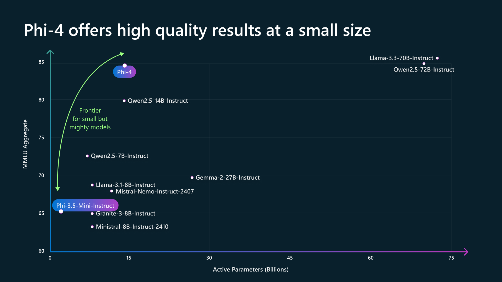

# Spring AI 入门实践：Spring AI 文本生成（Text Generation API）

> 基于 [Spring Boot 3.x](https://docs.spring.io/spring-boot/index.html) 、[Spring AI](https://docs.spring.io/spring-ai/reference/index.html)、[Ollama](https://ollama.com/) 的 `文本生成` 功能示例。

通过 [Ollama](https://ollama.ai/ "Ollama")，我们可以在本地运行各种大型语言模型 (LLM) 并从中生成文本。 Spring AI 通过  `OllamaChatModel` 支持 文本生成。

### 前提条件（Prerequisites）

首先，您需要访问 Ollama 实例。有以下几个选择：

- 在本地机器上[下载并安装 Ollama](https://ollama.com/download "下载并安装 Ollama")。
- 通过 [Testcontainers](https://docs.spring.io/spring-ai/reference/api/testcontainers.html "Testcontainers") 配置和运行 Ollama。
- 通过 [Kubernetes Service  Bindings](https://docs.spring.io/spring-ai/reference/api/cloud-bindings.html "Kubernetes Service  Bindings") 绑定到 Ollama 实例。

你可以从 Ollama 模型库中提取想要在应用程序中使用的模型：

```bash
ollama pull <model-name>
```

你还可以下载数千个免费的 [GGUF Hugging Face 模型](https://huggingface.co/models?library=gguf&sort=trending "GGUF Hugging Face 模型")中的任何一个：

```bash
ollama pull hf.co/<username>/<model-repository>
```

或者，您可以启用自动下载任何所需模型的选项：`自动拉取模型`。

### Ollama 对话模型

Ollama 模型库提供了很多的模型供我们选择，下面我们选择了，国产的是一个基于大型语言模型的对话系统，支持对话问答、文本生成等功能。

以下是一些推荐的 Ollama Chat 模型：

#### DeepSeek-R1

> DeepSeek-R1 是一种强大的混合专家 (MoE) 语言模型，具有经济的训练和高效的推理特点。在数学、代码和推理任务中实现了与 OpenAI-o1 相当的性能。

- 文档地址：https://ollama.com/library/deepseek-r1

##### 模型列表

> DeepSeek-R1 生成的推理数据，针对研究界广泛使用的几种密集模型进行微调而创建的模型。评估结果表明，提炼出的较小密集模型在基准测试中表现优异。

- DeepSeek-R1
```shell
ollama run deepseek-r1:671b
```
- DeepSeek-R1-Distill-Qwen-1.5B
```shell
ollama run deepseek-r1:1.5b
```
- DeepSeek-R1-Distill-Qwen-7B
```shell
ollama run deepseek-r1:7b
```
- DeepSeek-R1-Distill-Llama-8B
```shell
ollama run deepseek-r1:8b
```
- DeepSeek-R1-Distill-Qwen-14B
```shell
ollama run deepseek-r1:14b
```
- DeepSeek-R1-Distill-Qwen-32B
```shell
ollama run deepseek-r1:32b
```
- DeepSeek-R1-Distill-Llama-70B
```shell
ollama run deepseek-r1:70b
```


#### Qwen3

> Qwen3 是 Qwen 系列大语言模型的最新一代，提供了一套全面的密集模型与专家混合（MoE）模型。

- 模型地址：https://ollama.com/library/qwen3

> Qwen 3 系列是一套全面的密集与专家混合（MoE）模型集合。其旗舰模型 Qwen3-235B-A22B 在编码、数学、通用能力等基准测试中，与 DeepSeek-R1、o1、o3-mini、Grok-3 及 Gemini-2.5-Pro 等其他顶级模型相比，取得了具有竞争力的成绩。此外，小型 MoE 模型 Qwen3-30B-A3B 以十倍激活参数的优势超越了 QwQ-32B，即便是微型模型如 Qwen3-4B，其性能也能与 Qwen2.5-72B-Instruct 相媲美。

- 在数学、代码生成和常识逻辑推理方面，其推理能力显著增强，超越了之前的 QwQ（思考模式下）和 Qwen2.5 指令模型（非思考模式下）。
- 卓越的人类偏好对齐，擅长创意写作、角色扮演、多轮对话及指令遵循，以提供更自然、引人入胜且沉浸式的对话体验。
- 精通智能体能力，实现与外部工具在思考与无思考模式下的精准集成，并在复杂的基于智能体的任务中达到开源模型中的领先性能。
- 支持 100 多种语言和方言，具备强大的多语言指令遵循和翻译能力。

我们可以通过从下面模型列表中选择适合自己的模型运行：

##### Qwen3 模型列表

| 模型名称 | 大小 | 上下文窗口 | 输入类型 | 更新时间 |
|---------|------|-----------|----------|----------|
| qwen3:latest | 5.2GB | 40K | 文本 | 3个月前 |
| qwen3:0.6b | 523MB | 40K | 文本 | 3个月前 |
| qwen3:1.7b | 1.4GB | 40K | 文本 | 3个月前 |
| qwen3:4b | 2.5GB | 256K | 文本 | 1个月前 |
| qwen3:8b | 5.2GB | 40K | 文本 | 3个月前 |
| qwen3:14b | 9.3GB | 40K | 文本 | 3个月前 |
| qwen3:30b | 19GB | 256K | 文本 | 1个月前 |
| qwen3:32b | 20GB | 40K | 文本 | 3个月前 |
| qwen3:235b | 142GB | 256K | 文本 | 1个月前 |

##### 量化版本示例

| 模型名称 | 大小 | 量化类型 | 上下文窗口 |
|---------|------|----------|-----------|
| qwen3:0.6b-q4_K_M | 523MB | Q4_K_M | 40K |
| qwen3:0.6b-q8_0 | 832MB | Q8_0 | 40K |
| qwen3:0.6b-fp16 | 1.5GB | FP16 | 40K |
| qwen3:1.7b-q4_K_M | 1.4GB | Q4_K_M | 40K |
| qwen3:1.7b-q8_0 | 2.2GB | Q8_0 | 40K |
| qwen3:1.7b-fp16 | 4.1GB | FP16 | 40K |

##### 指令微调版本

| 模型名称 | 大小 | 类型 | 上下文窗口 |
|---------|------|------|-----------|
| qwen3:4b-instruct | 2.5GB | 指令微调 | 256K |
| qwen3:4b-instruct-2507-q4_K_M | 2.5GB | 指令微调+量化 | 256K |
| qwen3:4b-instruct-2507-q8_0 | 4.3GB | 指令微调+量化 | 256K |
| qwen3:4b-instruct-2507-fp16 | 8.1GB | 指令微调+FP16 | 256K |

##### 思维链版本
| 模型名称 | 大小 | 类型 | 上下文窗口 |
|---------|------|------|-----------|
| qwen3:4b-thinking | 2.5GB | 思维链 | 256K |
| qwen3:4b-thinking-2507-q4_K_M | 2.5GB | 思维链+量化 | 256K |
| qwen3:4b-thinking-2507-q8_0 | 4.3GB | 思维链+量化 | 256K |
| qwen3:4b-thinking-2507-fp16 | 8.1GB | 思维链+FP16 | 256K |

##### 大模型版本 (30B+)
| 模型名称 | 大小 | 类型 | 上下文窗口 |
|---------|------|------|-----------|
| qwen3:30b-a3b | 19GB | A3B架构 | 256K |
| qwen3:30b-a3b-instruct-2507-q4_K_M | 19GB | 指令微调+量化 | 256K |
| qwen3:30b-a3b-q4_K_M | 19GB | 量化 | 40K |
| qwen3:30b-a3b-instruct-2507-q8_0 | 32GB | 指令微调+量化 | 256K |
| qwen3:30b-a3b-thinking-2507-q4_K_M | 19GB | 思维链+量化 | 256K |
| qwen3:30b-a3b-q8_0 | 33GB | 量化 | 40K |
| qwen3:30b-a3b-thinking-2507-q8_0 | 32GB | 思维链+量化 | 256K |
| qwen3:30b-a3b-fp16 | 61GB | FP16 | 40K |
| qwen3:30b-a3b-instruct-2507-fp16 | 61GB | 指令微调+FP16 | 256K |
| qwen3:30b-a3b-thinking-2507-fp16 | 61GB | 思维链+FP16 | 256K |

##### 超大模型版本 (235B)

| 模型名称 | 大小 | 类型 | 上下文窗口 |
|---------|------|------|-----------|
| qwen3:235b-a22b | 142GB | A22B架构 | 256K |
| qwen3:235b-a22b-instruct-2507-q4_K_M | 142GB | 指令微调+量化 | 256K |
| qwen3:235b-a22b-q4_K_M | 142GB | 量化 | 40K |
| qwen3:235b-a22b-instruct-2507-q8_0 | 250GB | 指令微调+量化 | 256K |
| qwen3:235b-a22b-thinking-2507-q4_K_M | 142GB | 思维链+量化 | 256K |
| qwen3:235b-a22b-q8_0 | 250GB | 量化 | 40K |
| qwen3:235b-a22b-thinking-2507-q8_0 | 250GB | 思维链+量化 | 256K |
| qwen3:235b-a22b-fp16 | 470GB | FP16 | 40K |
| qwen3:235b-a22b-thinking-2507-fp16 | 470GB | 思维链+FP16 | 256K |


#### Llama 3.3

> Meta Llama 3 是 Meta Inc. 开发的一系列模型，是最新推出的先进模型，具有8B和70B两种参数大小（预训练或指令调整）。<br/>
Llama 3 指令调整模型针对对话/聊天用例进行了微调和优化，并且在常见基准测试中胜过许多可用的开源聊天模型。

- 文档地址：https://ollama.com/library/llama3.3

##### 模型变体

Instruct 是针对`聊天/对话场景`进行了`fine-tuned`。

```shell
ollama run llama3
ollama run llama3:70b
```

Pre-trained 的是基础模型。

```shell
ollama run llama3:text
ollama run llama3:70b-text
```

**注意**: 安装 `ollama run llama3` 将下载一个 4.7GB 的 docker 镜像。

#### Phi-4

> Phi-4 是一个微软开源的 14B 参数模型。

- 文档地址：https://ollama.com/library/phi-4

```shell
```



#### Google Gemma 2

> Google 的 Gemma 2 型号有两种尺寸：9B 和 27B，采用全新的架构设计，可实现一流的性能和效率。

- 文档地址：https://ollama.com/library/gemma2

##### 一流的性能

Gemma 2 拥有 270 亿个参数，其性能在基准测试中超越了比其规模大两倍的模型。这一突破性的效率为开放模型领域树立了新标准。

##### 两种尺寸：9B 和 27B 参数

- 9B 参数：`ollama run gemma2`
- 27B 参数：`ollama run gemma2:27b`

#### GLM-4

> GLM-4-9B 是智谱 AI 推出的最新一代预训练模型 GLM-4 系列中的开源版本。在语义、数学、推理、代码和知识等多方面的数据集测评中，GLM-4-9B 及其人类偏好对齐的版本 GLM-4-9B-Chat 均表现出超越 Llama-3-8B 的卓越性能。除了能进行多轮对话，GLM-4-9B-Chat 还具备网页浏览、代码执行、自定义工具调用（Function Call）和长文本推理（支持最大 128K 上下文）等高级功能。本代模型增加了多语言支持，支持包括日语，韩语，德语在内的 26 种语言。我们还推出了支持 1M 上下文长度（约 200 万中文字符）的 GLM-4-9B-Chat-1M 模型和基于 GLM-4-9B 的多模态模型 GLM-4V-9B。GLM-4V-9B 具备 1120 * 1120 高分辨率下的中英双语多轮对话能力，在中英文综合能力、感知推理、文字识别、图表理解等多方面多模态评测中，GLM-4V-9B 表现出超越 GPT-4-turbo-2024-04-09、Gemini1.0 Pro、Qwen-VL-Max 和 Claude 3 Opus 的卓越性能。

- 文档地址：https://ollama.com/library/glm4

```shell
ollama run glm4
```

#### Google Gemma

> Gemma 是 Google 及其 DeepMind 团队开发的一种新开放模型。其灵感来自 Google 的 Gemini 模型。

Gemma 有两种2b尺寸7b：

- `ollama run gemma:2b`
- `ollama run gemma:7b`（默认）

文档地址：https://ollama.com/library/gemma

```shell
ollama run gemma:2b
```

### 自动配置

Spring AI 为 Ollama 聊天客户端提供 Spring Boot 自动配置。要启用它，请将以下依赖项添加到项目的 Maven `pom.xml` 文件中：

```xml
<dependency>
    <groupId>org.springframework.ai</groupId>
    <artifactId>spring-ai-starter-model-ollama</artifactId>
</dependency>
```

或者，在你的 Gradle 构建文件 `build.gradle` 中添加：

```groovy
dependencies {
    implementation 'org.springframework.ai:spring-ai-starter-model-ollama'
}
```

#### Chat 属性

`spring.ai.ollama` 前缀的属性，可让您配置 Ollama Chat 客户端的连接。

| 属性  | 描述 | 默认值  |
| ------------ | ------------ | ------------ |
| `spring.ai.ollama.base-url` | Ollama API 服务器运行的基本 URL. | `http://localhost:11434`  |

`spring.ai.ollama.chat.options` 前缀的属性，可让您配置 Ollama Chat 客户端的连接。

这些`options` 属性基于 [Ollama 有效参数和值](https://github.com/jmorganca/ollama/blob/main/docs/modelfile.md#valid-parameters-and-values "Ollama 有效参数和值") 以及 [Ollama 类型](link:https://github.com/jmorganca/ollama/blob/main/api/types.go "Ollama 类型")。默认值基于：[Ollama type defaults](https://github.com/ollama/ollama/blob/b538dc3858014f94b099730a592751a5454cab0a/api/types.go#L364 "Ollama type defaults")。


| 属性  | 描述 | 默认值  |
| ------------ | ------------ | ------------ |
| `spring.ai.ollama.chat.enabled`      | 启用 Ollama 聊天客户端. | true  |
| `spring.ai.ollama.chat.options.model`  | [支持的模型名称](https://github.com/ollama/ollama?tab=readme-ov-file#model-library "支持的模型名称"). | mistral  |
| `spring.ai.ollama.chat.options.numa`              | 是否使用NUMA。                                          | false  |
| `spring.ai.ollama.chat.options.num-ctx`           | 设置用于生成下一个标记的上下文窗口的大小。 | 2048  |
| `spring.ai.ollama.chat.options.num-batch`         | ???                                                             | 512  |
| `spring.ai.ollama.chat.options.num-gqa`           | Transformer 层中 GQA 组的数量。某些型号需要，例如：llama2:70b 为 8。 | 1  |
| `spring.ai.ollama.chat.options.num-gpu`           | 要发送到 GPU 的层数。在 macOS 上，默认为 1 启用金属支持，0 禁用。这里的1表示 `NumGPU` 应该动态设置 | -1  |
| `spring.ai.ollama.chat.options.main-gpu`          | ???                                                             | -  |
| `spring.ai.ollama.chat.options.low-vram`          | ???                                                             | false  |
| `spring.ai.ollama.chat.options.f16-kv`            | ???                                                             | true  |
| `spring.ai.ollama.chat.options.logits-all`        | ???                                                             | -  |
| `spring.ai.ollama.chat.options.vocab-only`        | ???                                                             | -  |
| `spring.ai.ollama.chat.options.use-mmap`          | ???                                                             | true  |
| `spring.ai.ollama.chat.options.use-mlock`         | ???                                                             | false  |
| `spring.ai.ollama.chat.options.embedding-only`    | ???                                                             | false  |
| `spring.ai.ollama.chat.options.rope-frequency-base` | ???                                                           | 10000.0  |
| `spring.ai.ollama.chat.options.rope-frequency-scale` | ???                                                          | 1.0  |
| `spring.ai.ollama.chat.options.num-thread`        | 设置计算期间使用的线程数。默认情况下，Ollama 将检测到这一点以获得最佳性能。建议将此值设置为系统具有的物理 CPU 核心数（而不是逻辑核心数）。 0 = 让运行时决定 | 0  |
| `spring.ai.ollama.chat.options.num-keep`          | ???                                                             | 0  |
| `spring.ai.ollama.chat.options.seed`              | 设置用于生成的随机数种子。将其设置为特定数字将使模型为相同的提示生成相同的文本。  | -1  |
| `spring.ai.ollama.chat.options.num-predict`       | 生成文本时要预测的最大标记数。 （-1 = 无限生成，-2 = 填充上下文） | -1  |
| `spring.ai.ollama.chat.options.top-k`             | 减少产生废话的可能性。较高的值（例如，100）将给出更多样化的答案，而较低的值（例如，10）将更加保守。  | 40  |
| `spring.ai.ollama.chat.options.top-p`             | 与 top-k 一起工作。较高的值（例如，0.95）将导致更加多样化的文本，而较低的值（例如，0.5）将生成更加集中和保守的文本。  | 0.9  |
| `spring.ai.ollama.chat.options.tfs-z`             | Tail-free 用于减少输出中不太可能的标记的影响。较高的值（例如，2.0）将更多地减少影响，而值 1.0 将禁用此设置。 | 1.0  |
| `spring.ai.ollama.chat.options.typical-p`         | ???                                                             | 1.0  |
| `spring.ai.ollama.chat.options.repeat-last-n`     | 设置模型回溯多远以防止重复。 （默认值：64，0 = 禁用，-1 = num_ctx）   | 64  |
| `spring.ai.ollama.chat.options.temperature`       | 模型的温度。提高温度将使模型的答案更有创意。 | 0.8  |
| `spring.ai.ollama.chat.options.repeat-penalty`    | 设置惩罚重复的强度。较高的值（例如，1.5）将更强烈地惩罚重复，而较低的值（例如，0.9）将更宽松。 | 1.1  |
| `spring.ai.ollama.chat.options.presence-penalty`  | ???                                                             | 0.0  |
| `spring.ai.ollama.chat.options.frequency-penalty` | ???                                                             | 0.0  |
| `spring.ai.ollama.chat.options.mirostat`          | 启用 Mirostat 采样以控制困惑度。 （默认值：0、0 = 禁用、1 = Mirostat、2 = Mirostat 2.0） | 0  |
| `spring.ai.ollama.chat.options.mirostat-tau`      | 影响算法对生成文本反馈的响应速度。较低的学习率将导致调整速度较慢，而较高的学习率将使算法更具响应性。 | 5.0  |
| `spring.ai.ollama.chat.options.mirostat-eta`      | 控制输出的一致性和多样性之间的平衡。较低的值将导致文本更加集中和连贯。 | 0.1  |
| `spring.ai.ollama.chat.options.penalize-newline`  | ???                                                           | true  |
| `spring.ai.ollama.chat.options.stop`              | 设置要使用的停止序列。当遇到这种模式时，LLM 将停止生成文本并返回。可以通过在模型文件中指定多个单独的停止参数来设置多个停止模式。 | -  |

**提示**: 所有 `spring.ai.ollama.chat.options` 前缀的属性， 可以在运行期间通过添加特定请求参数到 `Prompt` 调用 实现覆盖.

### 聊天选项

[OllamaOptions.java](https://github.com/spring-projects/spring-ai/blob/main/models/spring-ai-ollama/src/main/java/org/springframework/ai/ollama/api/OllamaOptions.java "OllamaOptions.java") 提供模型配置，例如：要使用的模型、温度等。

启动时，可以使用 `OllamaChatModel(api, options)` 构造函数 或 `spring.ai.ollama.chat.options.*` 属性配置默认选项。

在运行时，您可以通过向调用添加新的、特定于请求的选项来覆盖默认选项Prompt。例如，要覆盖特定请求的默认型号和温度：

```java
ChatResponse response = chatModel.call(
    new Prompt(
        "Generate the names of 5 famous pirates.",
        OllamaOptions.create()
            .withModel("llama2")
            .withTemperature(0.4)
    ));
```

**提示**: 除了特定于模型的 [OllamaOptions](https://github.com/spring-projects/spring-ai/blob/main/models/spring-ai-ollama/src/main/java/org/springframework/ai/ollama/api/OllamaOptions.java "OllamaOptions") 之外，您还可以使用通过 [ChatOptionsBuilder#builder() ](https://github.com/spring-projects/spring-ai/blob/main/spring-ai-core/src/main/java/org/springframework/ai/chat/ChatOptionsBuilder.java "ChatOptionsBuilder#builder() ") 创建的可移植 [ChatOptions](https://github.com/spring-projects/spring-ai/blob/main/spring-ai-core/src/main/java/org/springframework/ai/chat/ChatOptions.java "ChatOptions")  实例。

### Sample Controller （自动配置）

[创建](https://start.spring.io/ "创建") 一个新的 Spring Boot 项目并将其添加 `spring-ai-ollama-spring-boot-starter` 到您的 pom（或 gradle）依赖项中。

在 `src/main/resources`目录下添加一个`application.properties`文件，以启用和配置 OpenAi Chat 客户端：

```properties
spring.ai.ollama.base-url=http://localhost:11434
spring.ai.ollama.chat.options.model=mistral
spring.ai.ollama.chat.options.temperature=0.7
```

**提示**: 将 `base-url` 替换为您的 Ollama 服务器 URL。

这将创建一个可以注入到您的类中的 `OllamaChatModel` 实现。下面是一个`@Controller`使用聊天客户端生成文本的简单类的示例。

```java
@RestController
public class ChatController {

    private final OllamaChatModel chatModel;

    @Autowired
    public ChatController(OllamaChatModel chatModel) {
        this.chatModel = chatModel;
    }

    @GetMapping("/ai/generate")
    public Map generate(@RequestParam(value = "message", defaultValue = "Tell me a joke") String message) {
        return Map.of("generation", chatModel.call(message));
    }

    @GetMapping("/ai/generateStream")
	public Flux<ChatResponse> generateStream(@RequestParam(value = "message", defaultValue = "Tell me a joke") String message) {
        Prompt prompt = new Prompt(new UserMessage(message));
        return chatModel.stream(prompt);
    }

}
```

#### 手动配置

如果你不想使用 Spring Boot 自动装配，你可以在你的应用里手动初始化 `OllamaChatModel`，[OllamaChatModel](https://github.com/spring-projects/spring-ai/blob/main/models/spring-ai-ollama/src/main/java/org/springframework/ai/ollama/OllamaChatModel.java "OllamaChatModel") 实现 `ChatClient` 和 `StreamingChatClient`， 并使用低级 OpenAi Api 客户端连接到 Ollama 服务。

添加 `spring-ai-ollama` 依赖到你的项目 Maven `pom.xml` 文件:

```xml
<dependency>
    <groupId>org.springframework.ai</groupId>
    <artifactId>spring-ai-ollama</artifactId>
</dependency>
```

或者，在你的 Gradle 构建文件 `build.gradle` 中添加：

```groovy
dependencies {
    implementation 'org.springframework.ai:spring-ai-ollama'
}
```

接下来，创建一个 `OllamaChatModel` 实例并将其用于文本生成请求：

```java
var ollamaApi = new OllamaApi();

var chatModel = new OllamaChatModel(ollamaApi).withModel(MODEL)
        .withDefaultOptions(OllamaOptions.create()
                .withModel(OllamaOptions.DEFAULT_MODEL)
                .withTemperature(0.9f));

ChatResponse response = chatModel.call(
    new Prompt("Generate the names of 5 famous pirates."));

// Or with streaming responses
Flux<ChatResponse> response = chatModel.stream(
    new Prompt("Generate the names of 5 famous pirates."));
```

- `OllamaOptions` 提供聊天请求的配置信息.

### Low-level OllamaApi Client

[OllamaApi](https://github.com/spring-projects/spring-ai/blob/main/models/spring-ai-ollama/src/main/java/org/springframework/ai/ollama/api/OllamaApi.java "OllamaApi") 为 [Ollama Chat Completion API](https://github.com/ollama/ollama/blob/main/docs/api.md#generate-a-chat-completion "Ollama Chat Completion API") 提供了轻量级 Java 客户端。

以下类图说明了 `OllamaApi` 聊天接口和构建块：


以下是如何以编程方式使用 api 的简单片段：

```java
OllamaApi ollamaApi = new OllamaApi("YOUR_HOST:YOUR_PORT");

// Sync request
var request = ChatRequest.builder("orca-mini")
    .withStream(false) // not streaming
    .withMessages(List.of(
            Message.builder(Role.SYSTEM)
                .withContent("You are a geography teacher. You are talking to a student.")
                .build(),
            Message.builder(Role.USER)
                .withContent("What is the capital of Bulgaria and what is the size? "
                        + "What is the national anthem?")
                .build()))
    .withOptions(OllamaOptions.create().withTemperature(0.9f))
    .build();

ChatResponse response = ollamaApi.chat(request);

// Streaming request
var request2 = ChatRequest.builder("orca-mini")
    .withStream(true) // streaming
    .withMessages(List.of(Message.builder(Role.USER)
        .withContent("What is the capital of Bulgaria and what is the size? " + "What is the national anthem?")
        .build()))
    .withOptions(OllamaOptions.create().withTemperature(0.9f).toMap())
    .build();

Flux<ChatResponse> streamingResponse = ollamaApi.streamingChat(request2);
```
