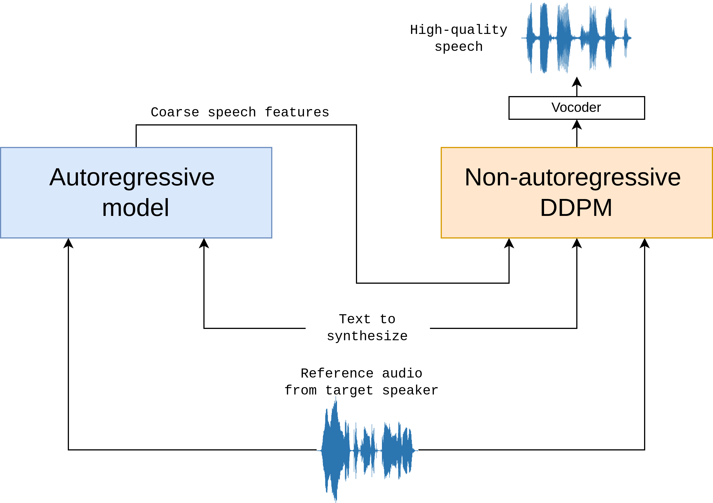

## spring-ai-ollama-voice-mars5tts

> 基于 [Spring Boot 3.x](https://docs.spring.io/spring-boot/index.html) 、[Spring AI](https://docs.spring.io/spring-ai/reference/index.html)、[Ollama](https://ollama.com/) 和 [MARS5-TTS](https://github.com/camb-ai/mars5-tts) 的 Text-To-Speech (TTS) 功能示例。

整合 ChatTTS 与 本地 Ollama 服务器并输出 Text-To-Speech (TTS) 音频响应

下面是离线模式下2种工具的简单组合：

- 大型语言模型：在离线模式下运行 [Ollama](https://ollama.com/) 本地模型
- 文本转语音：在离线模式下运行 [MARS5-TTS](https://github.com/camb-ai/mars5-tts) 本地模型

### 先决条件

您首先需要在本地计算机上运行 Ollama。请参阅官方 [Ollama 项目自述文件](https://github.com/ollama/ollama "Ollama 项目自述文件")，开始在本地计算机上运行模型。

ChatTTS 不提供API功能，还需要再本地计算机上运行 ChatTTS-ui，请参阅官方 [ChatTTS-ui](https://github.com/jianchang512/ChatTTS-ui) 项目进行调用。

#### 添加存储库和 BOM

Spring AI 工件发布在 `Spring Milestone` 和 `Snapshot` 存储库中。请参阅存储库部分将这些存储库添加到您的构建系统中。

为了帮助进行依赖管理，Spring AI 提供了 BOM（物料清单），以确保在整个项目中使用一致的 Spring AI 版本。请参阅[依赖管理](https://docs.spring.io/spring-ai/reference/getting-started.html#dependency-management "依赖管理")部分将 Spring AI BOM 添加到您的构建系统。

#### 自动配置

Spring AI 为 Ollama 聊天客户端提供 Spring Boot 自动配置。要启用它，请将以下依赖项添加到项目的 Maven `pom.xml` 文件中：

```xml
<dependency>
   <groupId>org.springframework.ai</groupId>
   <artifactId>spring-ai-ollama-spring-boot-starter</artifactId>
</dependency>
```

或者，在你的 Gradle 构建文件 `build.gradle` 中添加：

```groovy
dependencies {
    implementation 'org.springframework.ai:spring-ai-ollama-spring-boot-starter'
}
```

### Ollama Chat 模型

Ollama Chat 模型是一个基于大型语言模型的对话系统，支持对话问答、文本生成等功能。

#### Qwen2

> Qwen2 是阿里巴巴集团推出的全新系列大型语言模型。<br/>
Qwen2基于29 种语言的数据进行训练，包括英语和中文。

**注意**: 安装 `ollama run qwen2` 将下载一个 4.4GB 的 docker 镜像。

它有 4 种参数大小：0.5B、1.5B、7B、72B。
在 7B 和 72B 模型中，上下文长度已扩展至128k 个 token。

| Models       | Qwen2-0.5B | Qwen2-1.5B | Qwen2-7B | Qwen2-72B |
|--------------|------------|------------|----------|-----------|
| Params       | 0.49B      | 1.54B      | 7.07B    | 72.71B    |
| Non-Emb Params | 0.35B    | 1.31B      | 5.98B    | 70.21B    |
| GQA          | True       | True       | True     | True      |
| Tie Embedding | True      | True       | False    | False     |
| Context Length | 32K      | 32K        | 128K     | 128K      |

- 文档地址：https://ollama.com/library/qwen2

#### Llama 3

> Meta Llama 3 是 Meta Inc. 开发的一系列模型，是最新推出的先进模型，具有8B和70B两种参数大小（预训练或指令调整）。<br/>
Llama 3 指令调整模型针对对话/聊天用例进行了微调和优化，并且在常见基准测试中胜过许多可用的开源聊天模型。

**注意**: 安装 `ollama run llama3` 将下载一个 4.7GB 的 docker 镜像。

##### 模型变体

Instruct 是针对聊天/对话场景进行了fine-tuned。

```shell
ollama run llama3
ollama run llama3:70b
```

Pre-trained 的是基础模型。

```shell
ollama run llama3:text
ollama run llama3:70b-text
```

- 文档地址：https://ollama.com/library/llama3

### Text-To-Speech (TTS)

#### MARS5-TTS

> MARS5：一种用于疯狂韵律的新型语音模型

该模型遵循两阶段 AR-NAR 管道，具有独特的新颖 NAR 组件（有关更多信息，请参阅架构）。

只需 5 秒的音频和一段文字，MARS5 便可以生成语音，即使是在韵律复杂且多样化的场景中，例如体育评论、动漫等。



图：*MARS5 的高级架构流程*

给定文本和参考音频，通过自回归变换器模型获得粗略 (L0) 编解码器语音特征。然后，在多项式 DDPM 模型中细化文本、参考和粗略特征以生成剩余的编解码器码本值。然后对 DDPM 的输出进行声码以生成最终音频。

由于该模型是在原始音频和字节对编码文本上进行训练的，因此可以使用标点符号和大写字母等来控制它。例如，要添加停顿，请在转录文本中的该部分添加逗号。或者，要强调某个单词，请在转录文本中将其大写。这为引导生成输出的韵律提供了一种相当自然的方式。


- Hugging Face：https://huggingface.co/CAMB-AI/MARS5-TTS
- GitHub：https://github.com/camb-ai/mars5-tts

https://hub.docker.com/r/cambai/mars5ttsimage

docker pull cambai/mars5ttsimage


### Spring AI + MARS5-TTS Audio Speech 功能扩展

> Spring AI 并未提供 `Ollama` 整合 `MARS5-TTS` 文本转语音模型实现将对话内容转语音的能力，为了实验这块的能力，这里扩展了 Spring AI 对 [MARS5-TTS](https://github.com/camb-ai/mars5-tts) 的支持，以实现后面的边对话边转语音的功能 。

- Mars5TtsAudioApi 实现了 `MARS5-TTS` 的 `API` 接口，用于将对话内容转为语音。

```java
public ResponseEntity<SpeechResponse> createSpeech(SpeechRequest speechRequest) {

        Assert.notNull(speechRequest, "The request body can not be null.");
        Assert.isTrue(speechRequest.stream() == 0, "Request must set the steam property to 0.");
        MultiValueMap body = ApiUtils.toMultiValueMap(speechRequest);
        return this.restClient.post()
                .uri("/tts")
                .contentType(MediaType.APPLICATION_FORM_URLENCODED)
                .body(body)
                .retrieve()
                .toEntity(SpeechResponse.class);
    }
```


### 参考项目：

- https://github.com/hkgood/Ollama_ChatTTS 
- https://github.com/maudoin/ollama-voice
- https://github.com/coqui-ai/tts
- https://github.com/lucataco/cog-xtts-v2
